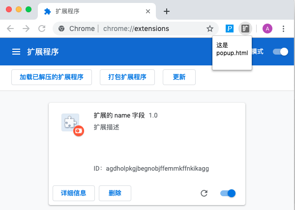

### 基本目录结构
___

### manifest.json
这个文件是最主要的文件, 是必须的。
`manifest.json` 里面包含了应用(扩展)的基本信息,
比如 **注入的脚本**、**后台脚本**、**工具栏弹窗(popup.html)页面**、**扩展图表** 等信息.

### 最基本的 `manifest.json` 配置
```
{
    "manifest_version": 2,
    "name": "扩展的 name 字段",
    "version": "1.0",   // 扩展版本(自定义)
    "description": "扩展描述",
    "browser_action": {
        "default_title": "鼠标移到工具栏的扩展上显示的title",
        "default_popup": "工具栏上的弹窗的页面, 由html编写"
    }
}
```

### 加载浏览器扩展查看效果
