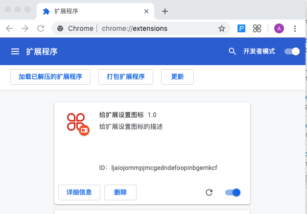

### 给扩展设置图标
___
### manifest.json 文件里面添加配置
```
{
    ...,
    // icons 定义扩展相关的图标, 在扩展后台显示.
    // 里面的键用来区分图片大小
    "icons": {
        "16": "图片相对地址",
        "48": "图片地址2",
        "128": "图片地址3"
    },
    "browser_action": {
        // 在工具栏里面的扩展图标
        // 如果这里没有指定图标
        // 扩展在工具栏的图标就是默认上面的图标
        "default_icon": {
            "16": "图片地址",
            "32": "图片地址"
        }
    }
    ...,
}
```

### 实例 example
```
{
    "manifest_version": 2,
    "name": "给扩展设置图标",
    "version": "1.0",
    "description": "给扩展设置图标的描述",
    "icons": {
        "16": "./icons/icon_red.png",
        "48": "./icons/icon_red.png",
        "128": "./icons/icon_red.png"
    },
    "browser_action": {
        "default_icon": {
            "16": "./icons/icon_grey.png",
            "32": "./icons/icon_grey.png"
        }
    }
}
```
> 对比图标颜色

### 预览效果
