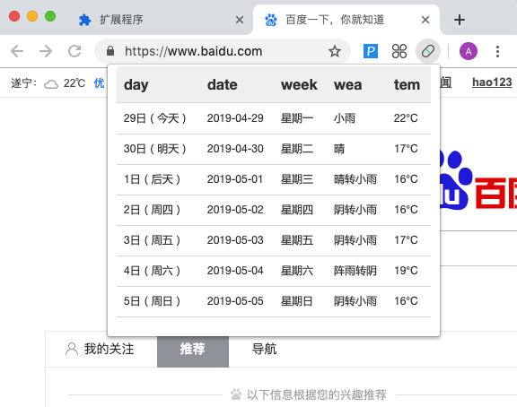
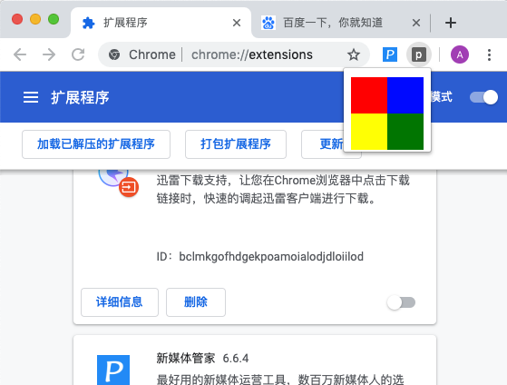
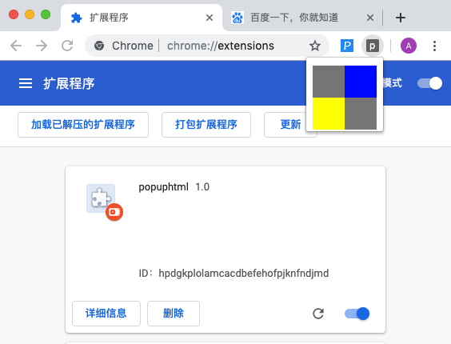

### popup.html
___
### 作用
弹窗界面(也就是点击浏览器工具栏里面的图标的时候弹出来的界面)

比如下面这个




### manifest.json 的配置
```
{
    ...,
    "browser_action": {
        "default_title": "这是鼠标悬停在扩展图标上的文字",
        "default_popup": "页面路径"
    },
    .....
}
```

### 实例 example
* 目录结构
```
├── example
│   ├── manifest.json
│   └── popup.html
```

* `manifest.json` 内容
```
{
    "manifest_version": 2,
    "name": "popuphtml",
    "version": "1.0",
    "browser_action": {
        "default_title": "popup的title",
        "default_popup": "popup.html"
    }
}
```

* `popup.html` 代码内容见 [example](./example) 源码

* 效果预览



## 加入css文件和js文件
* `css`样式可以写到 `popup.html` 中
* `js` 必须是外部引入, **不能**在内部写js代码

### 实例 example (在里面添加一个js文件)
* 目录结构
```
├── example
│   ├── click.js
│   ├── manifest.json
│   └── popup.html
```

* `popup.html` body最后加一个外部js引入
```
...
   <script src="click.js"></script>
</body>
...
```

* `click.js` 内容
```
// 作用: 点击方块之后, 该方块变成灰色
var div_list = document.getElementsByTagName("div");

for(var i = 0;i<4;i++) {
    div_list[i].onclick = function(e) {
        e.target.style.backgroundColor = "grey";
    }
}
```

#### 效果预览

