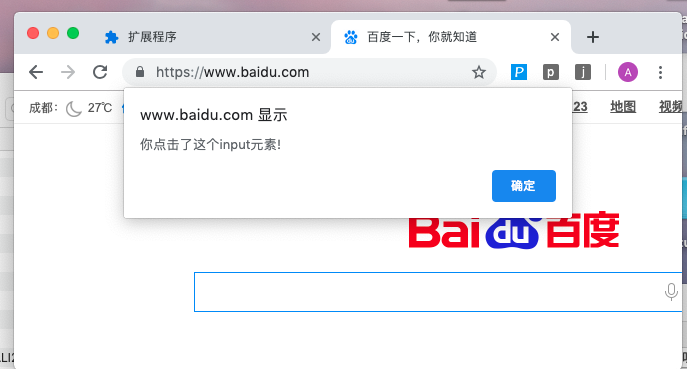

### 将js/css注入到指定(或所有)页面
___
* ### 向 `manifest.json` 里面加入 `content_scripts` 键
```
{
    ....,
    "content_scripts": [
        {
            // matches 里面是一个数组, 
            // 用来存放指定注入js的目标网址
            // 数组里面的元素可以带正则, 也可以不用带
            // 如果要将所有访问的网站都注入js,
            // 可以写成 "matches": ["<all_urls>"]
            "matches": ["*://www.baidu.com/*"],
            // 要注入的js脚本,可以是多个
            "js": ["./content.js"],
            // 也可以注入css样式表
            "css":["./css.css"]
        }
    ],
    ......
}
```

### 代码实例
* 目录结构
```
├── example
│   ├── content.js
│   ├── css.css
│   └── manifest.json
```

* `manifest.json` 文件
```
// 针对www.baidu.com的网站进行js/css注入
{
    "manifest_version": 2,
    "name": "js注入",
    "version": "1.0",
    "description": "插件入门,js注入实例",
    "content_scripts": [
        {
            "matches": ["*://www.baidu.com/*"],
            "js": ["./content.js"],
            "css": ["./css.css"]
        }
    ]
}
```

* `content.js` 文件
```
// 点击input元素就弹窗
var input_list = document.querySelectorAll("input");

input_list.forEach(function(element) {
    element.onclick = function() {
        alert("你点击了这个input元素!");
    };
});
```

### 运行效果 (点击搜索框)
